<div align="center">
  
</div>

zellij用サイドバープラグインです。タブ > ペインを縦並びで一覧し、各ペインで動くAIエージェント（Claude Code等）の状態を可視化して、グローバルキーでジャンプできます。

> [!NOTE]
> 名前は「布陣」＝陣を敷く、配置すること。複数のペインを部隊に見立てて配置し、俯瞰します。
> ちなみに `fujin` は英語話者には「風神」（風の神）とも読めます。陣を敷いて構える
> 「布陣」（静）と、風のように群れを駆け巡って見守る「風神」（動）——両方の姿をこの
> 名前に重ねています。

```text
▸ 1 scheme
    nu
    koka
▾ 2 zeli-c                ← アクティブタブ
    nvim
  » claude +2             ← working、サブエージェント2つ稼働中
▸ 3 review
  ◆ claude                ← 入力待ち（要対応）
```

- **一覧** — セッション内のタブとペインを常時サイドバーに表示します
- **状態の可視化** — 各エージェントが処理中か、入力待ちか、終わっているかがアイコンで分かります
- **ジャンプ** — 作業ペインにフォーカスを置いたまま、キー操作または行のクリックで目的のペインへ移動できます（名前・タブ名・cwd のファジー検索つき）

## 設計方針

> Local-first. Free. Zellij only. Just simple.

ネットワーク・クラウド接続には依存せず、設定はローカルのファイルだけで完結します。
恒久的に無料で、収益化のためにクラウド機能を後付けする予定もありません。汎用の
マルチプレクサ代替ではなく zellij に特化し、複雑さを増やす機能は入れません。

## 状態アイコン

ペイン行の先頭には、状態を表すアイコンが1文字出ます。色も状態ごとに違います。
**凡例はプラグインの中にあります**。navモードで `?` を押すとキー一覧の下に
アイコンと意味の対応が出るので、ここへ読みに戻る必要はありません。

エージェントが乗っていないペイン（ふつうのシェルなど）は、同じ位置に `›` が出ます。
状態の一種ではないので色は付きません。

ペイン名の後ろにはカウンタが付くことがあります。`+N` が稼働中のサブエージェント数、
`[N]` が未完了タスク数です。

`done` / `blocked` / `error` は**そのペインにフォーカスすると自動的にクリア**されます（既読モデル）。未対応のものだけが光ります。

## 必要なもの

- zellij 0.44 以上
- `curl`（リリースから取得する場合）または Rust + `rustup target add wasm32-wasip1`（自分でビルドする場合）
- `jq`（Claude Code フック用）

## クイックスタート

ビルド済みの wasm をリリースから取得します（**Rust は要りません**）:

```bash
curl -fsSLO https://github.com/yo-goto/fujin/releases/latest/download/setup.sh
bash setup.sh --download
```

`setup.sh` がやること:

- `fujin.wasm` とフック本体をリリースから `~/.config/zellij/plugins/` へダウンロードします
- `~/.config/zellij/layouts/fujin.kdl` を生成します。手で書くと踏みやすい
  `children` / `pane` の取り違えと `new_tab_template` の書き漏らし（[後述](#3-サイドバーの常駐レイアウト)）が、
  生成物の側で起こりません
- フック本体のパスを `~/.claude/settings.json` の10イベントへ登録します。同じパスを
  10箇所に書き写す作業がなくなります
- `config.kdl` に貼るべき設定を表示します（**このファイルは書き換えません**）

<details>
<summary>ソースからビルドする場合</summary>

Rust と `rustup target add wasm32-wasip1` が要ります。

```bash
git clone https://github.com/yo-goto/fujin.git && cd fujin
make install   # release ビルドして ~/.config/zellij/plugins/fujin.wasm へ配置
make setup     # レイアウトを生成し、Claude Code フックを登録する
```

`make setup` は `extras/setup.sh` を `--download` 無しで呼ぶだけです。追加の引数は
`make setup SETUP_ARGS="--no-hooks"` のように渡せます。

</details>

あとは表示された内容を `~/.config/zellij/config.kdl` に貼るだけです:

```kdl
plugins {
    fujin location="file:~/.config/zellij/plugins/fujin.wasm"
}

// keybinds ブロックが既にあるなら、中の bind だけを足してください
keybinds {
    shared_except "locked" {
        bind "Ctrl y" {
            MessagePlugin "fujin" {
                name "fujin_mode"
                floating true
            }
        }
    }
}

default_layout "fujin"
```

zellij を起動し直すと左端にサイドバーが出ます。初回は権限承認プロンプトが出るので、
そのペインにフォーカスして `y` を押してください。

| オプション | 内容 |
|---|---|
| `--download` | wasm とフック本体をリリースから取得する |
| `--version TAG` | 取得するリリース（既定 `latest`） |
| `--dry-run` | 何も書かずに、書き込む内容を表示する |
| `--no-hooks` | Claude Code フックの登録をスキップする |
| `--layout-only` / `--hooks-only` / `--config-only` | その処理だけ実行する |
| `--width N` | サイドバーの幅（既定 32）。`20%` のように割合で書くとそのまま使われ、`--resizable` を指定したのと同じ扱いになる |
| `--resizable` | 幅を桁数ではなく割合で書き、セッション中に zellij 標準の resize で伸縮できるようにする |
| `--force` | 既存のレイアウトファイルを確認なしで上書きする |

**更新するときも同じコマンドで済みます。** 再実行は安全で（フック登録は冪等、
`settings.json` はバックアップを取ります）、レイアウトの上書きだけ確認を挟みます。
フックの登録パスがずれている場合（`fujin-hook.sh` を移動したなど）は、再実行すると
新しいパスへ書き換わります。

> [!NOTE]
> `config.kdl` だけはスクリプトが書き換えません。`plugins` / `keybinds` は既存ブロックへの
> マージが必要で（`keybinds clear-defaults=true` やモード別の入れ子もある）、テキスト処理で
> 壊したときの復旧が重いためです。代わりに、いま何が未設定かを判定して表示します。

## セットアップ（手動でやる場合）

`make setup` が何をしているかの内訳です。スクリプトを使わずに手で設定する場合や、
既存の設定へ部分的に取り込みたい場合はこちらを参照してください。

### 1. wasm を配置する

wasm はどこに置いてもかまいませんが、OS を問わず `~/.config/zellij` が config
ディレクトリになるので、その配下にまとめておくと手順が環境に依存しません。

```bash
# リリースから取得する場合
mkdir -p ~/.config/zellij/plugins
curl -fsSL https://github.com/yo-goto/fujin/releases/latest/download/fujin.wasm \
  -o ~/.config/zellij/plugins/fujin.wasm

# 自分でビルドする場合（要 Rust）
make install   # release ビルドして同じ場所へ配置
```

置き場所を変えたい場合は `make install PLUGIN_DIR=/path/to/plugins` としてください。

### 2. エイリアスを定義する

`~/.config/zellij/config.kdl` に以下を書きます:

```kdl
plugins {
    fujin location="file:~/.config/zellij/plugins/fujin.wasm"
}
```

- **`file:~/…` の `~`（と `$HOME` などの環境変数）は zellij が展開する**ので、
  ホームディレクトリ名を書く必要はありません
- 以降、レイアウトにもキーバインドにも `"fujin"` とだけ書けば済みます。
  パスを1箇所にまとめられるほか、**設定の食い違いによる事故を構造的に防げます**
  （[設定](#設定)を参照）
- エイリアス定義の `location` に**相対パスは書けません**。cwd 補完が効かないため、
  絶対パスか `~` 付きか `https://…` にしてください

### 3. サイドバーの常駐（レイアウト）

デフォルトレイアウトのタブテンプレートにサイドバーを埋め込みます。例
（`~/.config/zellij/layouts/fujin.kdl`）:

```kdl
layout {
    default_tab_template {
        pane size=1 borderless=true {
            plugin location="zellij:tab-bar"
        }
        pane split_direction="vertical" {
            pane size=32 borderless=true {
                plugin location="fujin"
            }
            pane
        }
        pane size=1 borderless=true {
            plugin location="zellij:status-bar"
        }
    }
    // 同じ内容を new_tab_template にも書く（後述）
}
```

> [!CAUTION]
> `children` ではなく `pane` と書いてください。`children` は「このレイアウトが定義する
> タブのペインをここに差し込む」というマーカーなので、`tab` ノードを持たない
> テンプレートだけのレイアウトでは**何も入らず、ターミナルが0個のタブができます**。
> セッション作成時にこれが起きると zellij がそのまま終了します。

<!-- -->

> [!IMPORTANT]
> `new_tab_template` にも同じ内容を書いてください。`default_tab_template` は
> 「新規タブ用テンプレート」にフォールバックする実装ですが、**セッションマネージャ
> （`Ctrl+o` → `w`）でレイアウトを選んで作ったセッションではフォールバックが効かず**、
> zellij 組み込みのデフォルトが残ります。両方書けば起動経路に依存しません。

起動経路を問わず確実にしたい場合は、`NewTab` のキーバインド側でレイアウトを指定する
手もあります:

```kdl
bind "n" {
    NewTab { layout "fujin"; }
    SwitchToMode "normal"
}
```

`~/.config/zellij/config.kdl` に:

```kdl
default_layout "fujin"
```

お試しなら、常駐させずフローティングでも動きます:

```bash
zellij action new-pane --floating --width 40 --height 20 -p "fujin"
```

初回ロード時に権限承認プロンプトが出るので、ペインにフォーカスして `y` で承認してください
（要求権限: `ReadApplicationState` / `ChangeApplicationState` / `ReadCliPipes` /
`InterceptInput` / `MessageAndLaunchOtherPlugins` / `OpenTerminalsOrPlugins` /
`ReadPaneContents`）。
承認結果は展開後の wasm の**絶対パスごと**に記録されるので、同じ場所へ上書き更新する
限り再承認は要りませんが、**置き場所を変えると再承認になります**。

サイドバーの幅をセッション中に変えられるかどうかは、レイアウトでの書き方で決まります。
既定の `pane size=32`（**桁数指定**）は zellij 標準の resize の対象外で、境界は動きません。
セットアップ時に `--resizable` を付けると幅を**割合指定**で書くので、zellij 標準の resize で
そのまま伸縮できます。**`Ctrl+n` で resize モードに入り `h`（サイドバーが縮む）/
`H`（広がる）、`Esc` で抜ける**のが確実です。`Alt+-`（広がる）も使えますが、
**`Alt+=` / `Alt++` は `Shift` が必要な文字なので端末によっては届きません**
（JIS 配列では `=` が `Shift`+`-`、US 配列でも `+` が `Shift`+`=`）。よく使うなら
`Shift` の要らない文字へ割り当て直すのが楽です。

```kdl
// ~/.config/zellij/config.kdl の keybinds（shared_except "locked" など）へ
bind "Alt ," { Resize "Decrease"; }   // サイドバーが広がる
bind "Alt ." { Resize "Increase"; }   // サイドバーが縮む
```

セットアップは次のとおりです。

```sh
make setup SETUP_ARGS="--resizable --layout-only"
```

`--resizable` は `--width`（桁数）を実行時の端末幅から割合へ換算します。**zellij の
ペインの中で実行すると端末全体ではなくそのペインの幅を測ってしまう**ので、割合を
直接指定するほうが確実です（この場合 `--resizable` は要りません）。

```sh
make setup SETUP_ARGS="--width 20% --layout-only"
```

書き換えたレイアウトが効くのは**新しいセッションから**です。稼働中のセッションは
起動時のレイアウトのまま動き続けます。

代償として幅が端末幅に比例するようになり、狭い端末ではサイドバーもそのぶん狭くなります
（フッターの操作ヒントなどは幅32を前提に組まれています）。幅を固定したまま値だけ変えたい
場合は `--width N` を桁数のまま使ってください。

**幅を変えると、他のタブのサイドバーも同じ幅に揃います。** そのあとで作ったタブも
変更後の幅で並びます。zellij のレイアウトはタブ生成時の雛形なので放っておくとタブごとに
幅がばらつきますが、fujin が変更を検知して各タブのサイドバーを寄せています。**この追従は
割合指定のときだけ起きます**（桁数指定はそもそも resize が効かないため）。

追従は zellij の段階リサイズ（端末幅の5%刻み）で行うため、境界の**マウスドラッグ**で
刻みに乗らない幅にした場合、他のタブは**最も近い到達できる幅**（差は最大で半刻み）まで
寄ります。キーボード・CLI のリサイズなら全タブぴったり揃います。

### 4. グローバルキーバインド（ジャンプ機能）

`~/.config/zellij/config.kdl` の keybinds ブロック（`shared_except "locked"` など）に
追加します。navモード方式と直接キー方式があり、併用もできます。

#### navモード（推奨）

zellij本体の `Ctrl+p` → pane モードと同じ操作感です。`config.kdl` に書くのは**入場キー
1つだけ**で、モード内のキーはプラグインが自前で解釈します:

```kdl
bind "Ctrl y" {
    MessagePlugin "fujin" {
        name "fujin_mode"
        floating true
    }
}
```

> [!IMPORTANT]
> `floating true` は必ず書いてください。セッションに fujin が1つも居ないとき
> （レイアウトを使わずに作ったセッションなど）、この pipe には宛先が無いので zellij 自身が
> fujin を新規起動します。既定ではタイルで開くため作業ペインを分割して右側に出てしまい、
> プラグイン側からは直せません。`floating true` があればフローティングで開き、fujin が
> 自分で常駐サイドバーと同じ左端・幅32へ整えます（`Esc` やジャンプで閉じます）。
> 既に fujin が起動しているときの配送には影響しません。

`Ctrl+y` は zellij デフォルトと衝突しない空きキーです。埋まっていれば任意に変更してかまいません
（既定で使用済みなのは `p`/`t`/`n`/`h`/`s`/`o`/`q`/`g`）。
モードのキーマップはプラグイン側にあるので、**ビルトインモードを1つ潰す必要がなく**、
キーを増やしても `config.kdl` を触らずに済みます。操作方法は[使い方](#使い方)を参照してください。

#### 直接キー（モードなし）

1打鍵で動かしたい場合はこちらです:

```kdl
bind "Alt u" {
    MessagePlugin "fujin" { name "fujin_up"; }
}
bind "Alt d" {
    MessagePlugin "fujin" { name "fujin_down"; }
}
bind "Alt g" {
    MessagePlugin "fujin" { name "fujin_go"; }
}
bind "Alt c" {
    MessagePlugin "fujin" { name "fujin_toggle_cwd"; }
}
```

`fujin_toggle_cwd` は移動ではなく表示の切り替えで、cwd行（`show_cwd`）の表示を
実行中に反転します。`show_cwd` の設定は**起動時の初期値**という意味になり、
実行中の切り替えに `config.kdl` の書き換えや再起動は要りません。
全タブのサイドバーが同時に切り替わり、あとから作ったタブにも現在の状態が引き継がれます。

> [!CAUTION]
> `Alt Enter` にはバインドしないでください。Claude Code の Shift+Enter は端末側の設定
> （`/terminal-setup` が入れる `Shift+Return -> ESC CR`）に依存していて、zellij はその
> `ESC CR` を `Alt Enter` として解釈します。奪うと Shift+Enter の改行がペインに届かなくなります。

<!-- -->

> [!NOTE]
> `MessagePluginId` は使わないでください。サイドバーはタブごとに1インスタンス
> 起動するため、ID指定ではキーが衝突します。エイリアス（またはURL）指定の
> `MessagePlugin` なら全インスタンスに届きます。

### 5. Claude Code フック（状態通知）

`extras/claude-hooks/fujin-hook.sh` をフックとして登録します
（`make setup` はこれを `~/.config/zellij/plugins/` へコピーしてから、そのパスを登録します）。
手で書く場合は `~/.claude/settings.json` の `hooks` に追記してください:

```jsonc
{
  "hooks": {
    // 以下のイベントすべてに同じエントリを追加する:
    // SessionStart, UserPromptSubmit, Stop, StopFailure,
    // SessionEnd, SubagentStart, SubagentStop, TaskCreated, TaskCompleted
    "UserPromptSubmit": [
      {
        "hooks": [
          { "type": "command", "command": "/path/to/extras/claude-hooks/fujin-hook.sh" }
        ]
      }
    ],
    // Notification だけは matcher で種別を絞る
    "Notification": [
      {
        "matcher": "permission_prompt|agent_needs_input|idle_prompt|elicitation_dialog",
        "hooks": [
          { "type": "command", "command": "/path/to/extras/claude-hooks/fujin-hook.sh" }
        ]
      }
    ]
  }
}
```

- フックは**新しく起動した Claude Code セッションから**有効になります
- zellij 外（素のターミナル）で動く Claude Code では何もしません（no-op）
- サイドバーが起動していないときも完全な no-op です（副作用なし）

## トラブルシューティング

### サイドバーが出ない

レイアウトが効いていないケースがほとんどです。`~/.config/zellij/config.kdl` に
`default_layout "fujin"` があるか、レイアウトに `new_tab_template` が書かれているかを
確認してください（`setup.sh` は未設定の項目を判定して教えてくれます）。

いま何が読み込まれているかは、セッション内で `zellij action dump-layout` を実行すると
確認できます。

ペインの場所は確保されているのに**中身が完全に空白**という場合は、権限の承認が
途中で止まっている可能性があります。要求権限が1つでも未承認だと、承認プロンプトも
fujin の描画も出ないまま空白になります。以前のバージョンを承認済みで、その後に
要求権限が増えた場合にも起こります。

**レイアウトから起動したサイドバーには承認プロンプトが出ない**ので、fujin を
フローティングで開き直して承認してください（そちらには出ます）。

```bash
zellij action new-pane --floating \
  --plugin file:$HOME/.config/zellij/plugins/fujin.wasm
```

開いたペインに承認プロンプトが出るので `y` を押します。承認したらセッションを
作り直してください（同じセッションの空白サイドバーは空白のままです）。

wasm の置き場所を変えている場合は、そのパスを指定してください。承認は**展開後の
絶対パスごと**に記録されます。

### 更新したのに古い挙動のまま

**wasm の入れ替えは稼働中のセッションには反映されません。** 既存のインスタンスは古い
wasm のまま動き続けるので、セッションを作り直してください。

### キー（`Ctrl+y` など）が効かない

エイリアスを使わずに設定している場合、レイアウト側とキーバインド側で設定
（configuration）が食い違っている可能性があります。[設定](#設定)を参照してください。
エイリアスに寄せておけば構造的に起きません。

### 権限プロンプトが繰り返し出る

承認結果は**展開後の絶対パスごと**に記録されます。同じ場所へ上書き更新する限り
再承認は要りませんが、置き場所を変えると新しいパスとして扱われます。

### 起動しない・挙動がおかしい

zellij のキャッシュを消してから試してください。

```bash
rm -rf ~/Library/Caches/org.Zellij-Contributors.Zellij   # macOS
rm -rf ~/.cache/zellij                                   # Linux
```

キャッシュを消すと承認結果（`permissions.kdl`）も消えるので、次の起動で承認をやり直します。

### 設定を変えずに試したい

常駐させずフローティングで開けます。

```bash
zellij action new-pane --floating --width 40 --height 20 -p "fujin"
```

zellij 組み込みのプラグインマネージャ（`Ctrl+o` → `p`）から wasm のパスを指定して
読み込むこともできます。

## 使い方

作業ペインにフォーカスを置いたまま操作できます（サイドバーにフォーカスを移す必要は
ありません。そもそもサイドバーはフォーカス巡回から除外されています）。

### クリックでジャンプ

サイドバーのペイン行を左クリックすると、そのペインへジャンプします。モードに入る
必要はありません。別のタブのペインならタブごと移動し、フローティングペインなら
フローティング層が出てきます。タブ見出しの行や一覧より下の余白をクリックしても
何も起きません。

反応しない場合は、zellij 本体の `mouse_mode` が無効になっていないか
`~/.config/zellij/config.kdl` を確認してください（既定は有効）。

### navモード

`Ctrl+y`（上で設定したキー）を押すとサイドバーのヘッダが
`[NAV]  ?:help  esc:exit` に変わり、以下のキーが効きます:

| キー | 動作 |
|---|---|
| `j` / `↓` | 次の行 |
| `k` / `↑` | 前の行 |
| `g` / `G` | 先頭 / 末尾 |
| `Enter` / `l` / `Space` | 選択中のペインへジャンプしてモードを抜ける |
| `/` | 検索サブモードに入る（下記） |
| `n` | 番号ジャンプサブモードに入る（下記） |
| `t` | トリアージモードに入る（対応が必要なペインを緊急度順に一覧） |
| `d` | 終了操作サブモードに入る（下記） |
| `m` / `M` | マークを付け外し / すべて外す（一括での終了操作の対象） |
| `p` | プレビューの表示を切り替える（下記） |
| `r` | プレビュー中のペインを既読にする（プレビュー表示中のみ） |
| `?` | キーのヘルプを開く（下記） |
| `Esc` / `q` | モードを抜ける |

上記以外のキーでもモードを抜けます（キー入力が取り残されないための安全弁です）。

ハイライトされている行は常にフォーカス中のペインに追従するので、navモードは
作業中のペインから始まります。例外は `Esc` で抜けたあとフォーカスを動かさずに
入り直した場合で、このときだけ前回見ていた位置から再開します。

navモード中はサイドバーが zellij のフォーカスを借りるので、作業していたペインは
**枠は残ったまま、フォーカス中を示す強調だけが外れます**。そのままではこの強調と
サイドバーのハイライトが同時に見えて、どちらが操作対象か分からなくなるためです。
モードを抜けるとフォーカスは元のペイン（ジャンプした場合はジャンプ先）へ戻ります。
navモード中に自分でフォーカスを動かした場合（別のペインをクリックした等）は、
フォーカスを奪い返さずにモードを抜けます。

### 検索（navモード内の `/`）

navモード中に `/` を押すとヘッダがクエリ入力行（`/…`）に変わり、ペイン名・
所属タブ名・cwd に対するファジー検索でツリーを絞り込めます。一致した文字は
ハイライトされ、その場所がどのフィールドに当たったかの提示を兼ねます
（cwd ヒット時は `show_cwd` が無効でもその行に cwd が出ます）。

検索サブモードは vim のように**編集状態**と**操作状態**の2つに分かれています。
`/` で入った直後は編集状態で、`Esc` を押すとクエリを持ったまま操作状態へ移ります。
いまどちらに居るかは以下の手がかりで分かります。

| | 編集状態 | 操作状態 |
|---|---|---|
| クエリの文字色 | 通常 | 沈む（dim） |
| フッターの操作ヒント | `esc:browse  enter:jump` | `j/k:move  ?:help  i:edit …` |

テキストカーソル（IMEの変換候補ウィンドウが付いてくる、端末が描くカーソル）は
両状態とも入力欄の末尾に置いています（形はプラグイン側から指定できず端末の設定に
従うため、状態の手がかりとしては使っていません）。

編集状態のキー:

| キー | 動作 |
|---|---|
| 印字可能文字 | クエリ末尾に追加（`?` も含む。navモードの1文字ショートカットは全て無効になる） |
| `Backspace` | クエリ末尾を1文字削除 |
| `↓` / `Tab`、`↑` / `Shift+Tab` | 絞り込み結果内でカーソル移動 |
| `Enter` | 選択行へジャンプしてnavモードごと抜ける（0件時は何もしない） |
| `Esc` | 操作状態へ移る（クエリは破棄されません） |

操作状態のキー（**下記以外のキーは何も起きません**）:

| キー | 動作 |
|---|---|
| `j` / `k`、`↓` / `Tab`、`↑` / `Shift+Tab` | 絞り込み結果内でカーソル移動 |
| `i` | 編集状態へ戻る（クエリはそのまま） |
| `?` | キーのヘルプを開く（下記） |
| `Enter` | 選択行へジャンプしてnavモードごと抜ける |
| `Esc` | クエリを破棄してnavモードへ戻る（もう一度 `Esc` でモードを抜ける） |

クエリは検索を抜けるたびに破棄され、次回は常に空から始まります。cwd はフック
から通知を受けたペインだけが持つので、一般のシェルペインは cwd では一致しません。

### 番号ジャンプ（navモード内の `n`）

`n` を押すと選択対象のペインに通し番号（タブ内ではなく全タブ貫通の連番）が振られ、
行の左に番号列が出ます。数字を打つたびに前方一致で候補が絞られ、候補が1件に
なった時点で即ジャンプします（`Enter` は要りません）。番号は総数の桁数に
ゼロ埋めされるので（12ペインなら `01`, `02`, …）、ある番号が別の番号の前方一致に
なることがなく、「`1` を打ったが `10` があるので確定できない」が起きません。

| キー | 動作 |
|---|---|
| `0`〜`9` | 候補を絞り込み、1件になった時点でジャンプ |
| `Backspace` | 入力済みの数字を1つ削除 |
| `?` | キーのヘルプを開く（下記） |
| `Esc` | サブモードを抜けてツリー表示へ戻る（navモードは継続） |

存在しない番号を打つと `Backspace` での訂正を待たずにバッファが空に戻ります。
番号列はサブモード中だけ出るので、平常時の行の幅配分は変わりません。

### ペインの終了操作（navモード内の `d`）

`d` を押すとフッターが確認プロンプト（`c:close k:kill x:kill+close`）に変わり、
テーマのエラー色で表示されます。3つのうちどれかを選ぶまで何も起きず、`Esc` で
取り消せます。プロンプトにペイン名は出しません — 対象は選択行のハイライトで
分かっており、フッターの幅では名前の大半が切り詰められてしまうためです。

| キー | 動作 |
|---|---|
| `c` | プロセスには触れず、ペインを閉じる |
| `k` | ペインのプロセスに `SIGKILL` を送る |
| `x` | kill してから、ペインも閉じる |
| `?` | キーのヘルプを開く（下記） |
| `Esc` | 取り消してツリー表示へ戻る（navモードは継続） |

対象がエージェント・コマンドペイン・無関係なシェルのいずれでも、3操作とも同じく
選べます。シェルを kill すると子プロセスも巻き添えで終了し、ペインは zellij が
自動的に閉じます。一方、コマンドペイン（`zellij run -- …`）はコマンドが死んでも
ペインが残るため、そこで `x` が効きます。すでに終了しているコマンドペインへの
kill は何も起こしません。

対象は `m` でマークしたペインがあればその全部、無ければ選択行の1ペインです。
マークはタブをまたいでよく、`M` でまとめて外せます。

### プレビュー（navモード内の `p`）

`p` を押すとサイドバーの右隣にプレビューが開き、選択している（検索の絞り込み結果・
トリアージ一覧ではカーソル位置の）ペインの内容が出ます。フォーカスは移らないので、
`j` / `k` で選択を動かしながら「そのペインで何が起きているか」を見て回れます。
もう一度 `p` を押すか、ジャンプ・navモードの退場でプレビューは閉じます。

| キー | 動作 |
|---|---|
| `p` | プレビューの表示を切り替える（検索サブモード中は `alt+p`） |
| `r` | プレビュー中のペインを既読にする（`done` / `blocked` / `error` のみ） |

出るのは**選択が動いた時点のスナップショット**です。対象ペインが裏で動き続けても、
選択を動かさない限り表示は変わりません（定期的な取り直しはしません）。また、
zellij がプラグインに渡せるのは装飾のないプレーンテキストだけなので、色や太字は
再現されません。忠実な再現ではなく「大体の様子を掴む」ためのものです。

見て回るだけでは既読になりません（フォーカスを移していないため）。確認したことを
伝えるには `r` を押してください。

### ヘルプ（navモード内の `?`）

サイドバーの幅（32文字）には全キーの説明が収まらないため、常時出るヒントは
ヘッダの `?:help` / `esc:exit` だけに絞ってあります。`?` を押すとヘッダとフッターは
そのままに、ツリーの部分がキー一覧と状態アイコン凡例に切り替わり、何かキーを押せば
元の表示（navモードまたは検索サブモード）に戻ります。ヘルプを閉じるためのキーはそのままでは操作として解釈されないので、
閉じたあとに改めて押し直してください。navモードは開いている間も継続します。

### イベント → 状態のマッピング

| フックイベント | 状態遷移 |
|---|---|
| `SessionStart` | idle（登録・カウンタリセット） |
| `UserPromptSubmit` | working |
| `Notification` | blocked（メッセージ保持） |
| `Stop` | done（バックグラウンドのサブエージェントが残っている間は working のまま） |
| `StopFailure` | error（後続の `Stop` では上書きされない） |
| `SessionEnd` | 登録解除 |
| `SubagentStart` / `SubagentStop` | サブエージェント数 ±1（`Stop` 後に最後の1つが終わったら done） |
| `TaskCreated` / `TaskCompleted` | 未完了タスク数 ±1 |

## 設定

**エイリアス定義（`config.kdl` の `plugins` ブロック）に書いてください。**
設定を書く場所として fujin がサポートするのはここだけです（→
[サポートするのはエイリアス経由だけです](#サポートするのはエイリアス経由だけです)）。

設定は下の一覧がすべてです。

<!-- settings:begin -->
<!-- ここは repos/main/src/config.rs の SETTINGS から生成しています。手で直さず `make readme` を実行してください -->

```kdl
plugins {
    fujin location="file:~/.config/zellij/plugins/fujin.wasm" {
        show_cwd              "true"
        show_deploy_animation "false"
        up_key                "Alt u"
        down_key              "Alt d"
        go_key                "Alt g"
        toggle_cwd_key        "Alt c"
    }
}
```

| キー | 値 | 既定 | 説明 |
| --- | --- | --- | --- |
| `show_cwd` | `"true"` / `"false"` | `false` | ペイン行の下に cwd を表示します（フック設定済みのペインのみ） |
| `show_deploy_animation` | `"true"` / `"false"` | `true` | 新規エージェントを検出したときヘッダーで配置演出を再生します |
| `up_key` | キー表記（`"Alt u"` / `"alt+u"`） | 未設定（そのヒントを出さない） | `fujin_up` に割り当てたキーの表記（フッターのヒント用・表示専用） |
| `down_key` | キー表記（`"Alt u"` / `"alt+u"`） | 未設定（そのヒントを出さない） | `fujin_down` に割り当てたキーの表記（フッターのヒント用・表示専用） |
| `go_key` | キー表記（`"Alt u"` / `"alt+u"`） | 未設定（そのヒントを出さない） | `fujin_go` に割り当てたキーの表記（フッターのヒント用・表示専用） |
| `toggle_cwd_key` | キー表記（`"Alt u"` / `"alt+u"`） | 未設定（そのヒントを出さない） | `fujin_toggle_cwd` に割り当てたキーの表記（フッターのヒント用・表示専用） |

<!-- settings:end -->

cwd はフックのペイロード由来なので、フック設定済みのエージェントペインにのみ表示されます。

### 値の書き方

- 値は引用符で囲んで書いてください（`show_cwd "true"`）。プロパティ形式
  （`show_cwd="true"`）でも同じ意味に解釈します
- 真偽値として受け付けるのは `"true"` と `"false"` だけです。`1` や `yes` は
  解釈しません
- 解釈できない値があったときは、**起動直後の数秒だけ**サイドバーのフッターに
  `!bad value: show_cwd` のように警告が出ます。その項目は既定値のまま動きます

### フッターのキーヒント

`up_key` / `down_key` / `go_key` / `toggle_cwd_key` は**表示専用**です。キーを割り当てるものではないので、
割り当て自体は通常どおり行い（[直接キー](#直接キーモードなし)参照）、同じキーをここにも
書いてください。

同じキーを2箇所に書くことになりますが、fujin 側から割り当てを読み取る方法がありません。
zellij はプラグインに「このキーが何らかのプラグイン pipe に割り当たっている」ことまでしか
渡さず、宛先の pipe 名を落とすため、`fujin_up` と `fujin_go` を区別できないからです。
書かなかった項目は、そのヒントだけが出なくなります。

表記は zellij の書き方（`"Alt u"`）でも fujin の画面表記（`"alt+u"`）でも受け付け、
どちらも `alt+u` として表示します。解釈できない値は書かれたまま表示されるので、
書き間違いは黙って消えるのではなく見える形で残ります。

### サポートするのはエイリアス経由だけです

fujin が動作を保証するのは、**エイリアス定義（`config.kdl` の `plugins` ブロック）に
設定を書き、レイアウトとキーバインドの両方からそのエイリアス名で参照する**構成だけです。
レイアウトに wasm のパスを直接書く構成でも動きはしますが、サポート対象外です
（下記の食い違いを自力で避ける必要があります）。

> [!WARNING]
> `MessagePlugin` の宛先照合は**wasm のパスだけでなく設定（configuration）込み**で行われます。
> レイアウトの plugin ブロックにだけ `show_cwd "true"` を書き、キーバインド側に書かないと、
> 両者は別物と見なされて**キーが常駐サイドバーに届きません**。しかも届かないだけで済まず、
> zellij は**設定の一致する新しいインスタンスをその場に開いてしまいます**（実測: 打鍵1回で
> プラグインペインが1枚増えます）。fujin のサイドバーは `set_selectable(false)` で
> フォーカス巡回から外れているため、**そうしてできたペインはユーザーにも CLI にも閉じられません**。

エイリアスに寄せておけば、レイアウトもキーバインドも同じ定義を参照するので、この
食い違いは起きません。エイリアスを使わない場合は、レイアウトと**すべての**
`MessagePlugin` に同じ configuration を書き写す必要があります。

## ワイヤプロトコル（他エージェントの対応）

プラグインは pipe 名 `fujin_status` で以下のJSONを受け取ります。
Claude Code 以外のエージェント（codex 等）も、この形式で送れば同じように表示されます:

| エージェント | 対応状況 |
|---|---|
| Claude Code | 動作確認済み。`extras/claude-hooks/fujin-hook.sh` を参照 |
| その他（codex 等） | 未検証。下記の形式で送れば動作するはずだが、実機での確認は済んでいない |

```bash
zellij pipe --name fujin_status -- '{
  "pane_id": '$ZELLIJ_PANE_ID',
  "agent": "codex",
  "event": "UserPromptSubmit",
  "cwd": "/path/to/project"
}'
```

- `pane_id`: zellij が各ペインに与える `$ZELLIJ_PANE_ID`
- `event`: 上記マッピング表のイベント名
- `cwd` / `detail`: 任意

外部から使うのは `fujin_status` と、キーバインド用の `fujin_up` /
`_down` / `_go` / `_mode` / `_toggle_cwd` だけです。`fujin_sync_state` / `_read` /
`_selection` はインスタンス間の同期用の内部プロトコルなので、外から叩かないでください。

> [!IMPORTANT]
> `--plugin` オプションは付けないでください。付けると未起動のプラグインを
> zellij が勝手に起動してしまいます。付けなければ、起動中のプラグインにのみ配送され、
> 未起動時は無害な no-op になります。

## 開発

開発タスクは Makefile にまとめてあります。コミット前に `make check`
（`fmt-check` → `lint` → `test`）を通してください。

ビルド・テスト・手動確認の詳しい手順と、実装上のハマりどころは
別途 `docs/dev/` にまとめています。

## ライセンス

MIT License（`LICENSE` を参照）。依存している `zellij-tile` も MIT です。
