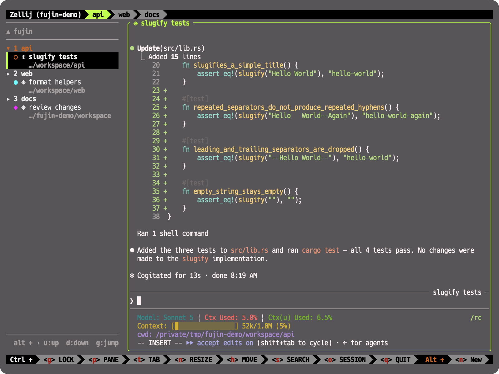

<div align="center">
  
</div>

A sidebar plugin for zellij. It lists tabs > panes in a vertical tree, visualizes
the state of AI agents (Claude Code, etc.) running in each pane, and lets you
jump to them with global keybindings.

<div align="center">
  
</div>

> [!NOTE]
> The name comes from the Japanese word 布陣 (*fujin*), "to deploy troops" /
> "to arrange a formation" — treating your panes as a formation to arrange and
> oversee at a glance. To English speakers, `fujin` also reads as 風神 (*fūjin*),
> the Japanese god of wind — pairing the stillness of forming up with the motion
> of wind sweeping across your panes to watch over them.

```text
▸ 1 scheme
    nu
    koka
▾ 2 zeli-c                ← active tab
    nvim
  » claude +2             ← working, 2 subagents running
▸ 3 review
  ◆ claude                ← waiting for input (needs attention)
```

- **Overview** — every tab and pane in the session, always visible in the sidebar
- **State at a glance** — an icon tells you whether each agent is working,
  waiting on you, or finished
- **Jump** — reach any pane with a couple of keystrokes or a single click, while
  your focus stays in your working pane (with fuzzy search over pane name, tab
  name, and cwd)

## Design principles

> Local-first. Free. Zellij only. Just simple.

No network or cloud dependency — configuration lives entirely in local files.
Free forever, with no plan to bolt on cloud features to monetize later. Not a
general-purpose multiplexer replacement, but a zellij-only plugin that doesn't
take on features that would add complexity.

## Status icons

Every pane row starts with a one-character state icon, and each state has its
own color. **The legend lives in the plugin**: press `?` in nav mode and it
sits right under the key list, so you never have to come back here to read it.

Panes without an agent (a plain shell, say) show `›` in that same spot. It is
not one of the states, so it carries no color.

Two counters may follow the pane name: `+N` for active subagents, `[N]` for
incomplete tasks.

`done` / `blocked` / `error` are **cleared automatically once you focus that
pane** (a read-receipt model). Only the ones you haven't attended to stay lit.

**Command panes get the same icons.** Anything started as a command pane
(`zellij run -- docker build .`, a `command` block in a layout, …) shows `»`
while it runs and `●` / `×` when it exits, so a long build tells you it is done
the same way an agent does. No hook or setup is needed — zellij already knows
the command. Panes with no name show the command line instead.

## Requirements

- zellij 0.44 or later
- `curl` (to fetch a release) or Rust + `rustup target add wasm32-wasip1` (to build it yourself)
- `jq` (for the Claude Code hook)

## Quick start

Grab the prebuilt wasm from the latest release (**no Rust needed**):

```bash
curl -fsSLO https://github.com/yo-goto/fujin/releases/latest/download/setup.sh
bash setup.sh --download
```

What `setup.sh` does:

- Downloads `fujin.wasm` and the hook script into `~/.config/zellij/plugins/`.
- Generates `~/.config/zellij/layouts/fujin.kdl`. The two mistakes that are easy
  to make by hand — `children` vs `pane`, and forgetting `new_tab_template`
  ([details below](#3-keep-the-sidebar-resident-layout)) — cannot happen in the
  generated file.
- Registers the hook's path for all 10 events in `~/.claude/settings.json`. No
  writing the same path ten times.
- Prints the snippet to add to `config.kdl` — it **never edits that file**.

<details>
<summary>Building from source instead</summary>

Needs Rust and `rustup target add wasm32-wasip1`.

```bash
git clone https://github.com/yo-goto/fujin.git && cd fujin
make install   # release build, copied to ~/.config/zellij/plugins/fujin.wasm
make setup     # generate the layout, register the Claude Code hooks
```

`make setup` just runs `extras/setup.sh` without `--download`. Extra arguments go
through `SETUP_ARGS`, e.g. `make setup SETUP_ARGS="--no-hooks"`.

</details>

Then paste what it printed into `~/.config/zellij/config.kdl`:

```kdl
plugins {
    fujin location="file:~/.config/zellij/plugins/fujin.wasm"
}

// if you already have a keybinds block, add just the bind inside it
keybinds {
    shared_except "locked" {
        bind "Ctrl y" {
            MessagePlugin "fujin" {
                name "fujin_mode"
                floating true
            }
        }
    }
}

default_layout "fujin"
```

Restart zellij and the sidebar appears on the left. On first load, focus that
pane and press `y` to approve the permission prompt.

| Option | Effect |
|---|---|
| `--download` | Fetch the wasm and the hook script from a release |
| `--version TAG` | Which release to fetch (default `latest`) |
| `--dry-run` | Show what would be written, write nothing |
| `--no-hooks` | Skip the Claude Code hook registration |
| `--layout-only` / `--hooks-only` / `--config-only` | Run just that part |
| `--width N` | Sidebar width (default 32). A percentage such as `20%` is written as-is and implies `--resizable` |
| `--resizable` | Write the width as a percentage instead of a fixed column count, so zellij's own resize can move the border during a session |
| `--force` | Overwrite an existing layout file without asking |

**Updating is the same command.** Re-running is safe — hook registration is
idempotent, `settings.json` is backed up first, and only the layout overwrite
asks for confirmation. If the registered hook path has gone stale (you moved
`fujin-hook.sh`), re-running rewrites it to the new one.

> [!NOTE]
> `config.kdl` is the one file the script won't touch. `plugins` and `keybinds`
> need to be merged into blocks you may already have (possibly with
> `keybinds clear-defaults=true` and per-mode nesting), and getting that wrong
> with text munging is expensive to recover from. It reports which pieces are
> still missing instead.

## Setup (by hand)

This is what `setup.sh` does, step by step. Follow it if you'd rather not run the
script, or if you're folding fujin into an existing configuration.

### 1. Place the wasm

The wasm can live anywhere, but `~/.config/zellij` is the config directory on
every OS, so keeping it there makes the setup steps environment-independent.

```bash
# from a release
mkdir -p ~/.config/zellij/plugins
curl -fsSL https://github.com/yo-goto/fujin/releases/latest/download/fujin.wasm \
  -o ~/.config/zellij/plugins/fujin.wasm

# or build it yourself (needs Rust)
make install   # release build, copied to the same place
```

To put it somewhere else: `make install PLUGIN_DIR=/path/to/plugins`.

### 2. Define an alias

In `~/.config/zellij/config.kdl`:

```kdl
plugins {
    fujin location="file:~/.config/zellij/plugins/fujin.wasm"
}
```

- **`~` (and env vars like `$HOME`) in `file:~/…` are expanded by zellij**, so
  you don't need to hardcode your home directory name
- From here on, layouts and keybindings only need to say `"fujin"`. Besides
  keeping the path in one place, this **structurally prevents a whole class of
  configuration-mismatch bugs** (see [Configuration](#configuration))
- The alias's `location` **cannot be a relative path**. cwd expansion doesn't
  apply here, so use an absolute path, a `~`-prefixed path, or `https://…`

### 3. Keep the sidebar resident (layout)

Embed the sidebar in the default layout's tab template. Example
(`~/.config/zellij/layouts/fujin.kdl`):

```kdl
layout {
    default_tab_template {
        pane size=1 borderless=true {
            plugin location="zellij:tab-bar"
        }
        pane split_direction="vertical" {
            pane size=32 borderless=true {
                plugin location="fujin"
            }
            pane
        }
        pane size=1 borderless=true {
            plugin location="zellij:status-bar"
        }
    }
    // put the same content in new_tab_template too (see below)
}
```

> [!CAUTION]
> Use `pane`, not `children`. `children` is a marker meaning "insert this
> layout's own tab panes here." A template-only layout with no `tab` node has
> nothing to insert, so you'd end up with **a tab that has zero terminal panes**.
> If that happens at session creation, zellij just exits.

<!-- -->

> [!IMPORTANT]
> Write the same content into `new_tab_template` as well. `default_tab_template`
> is documented to fall back to the "new tab template," but **that fallback
> doesn't kick in when a session is created via the session manager
> (`Ctrl+o` → `w`) with a chosen layout** — you get zellij's built-in default
> instead. Writing both makes it work regardless of how the tab was created.

If you want it to work reliably no matter the launch path, you can also specify
the layout on the `NewTab` keybinding itself:

```kdl
bind "n" {
    NewTab { layout "fujin"; }
    SwitchToMode "normal"
}
```

And in `~/.config/zellij/config.kdl`:

```kdl
default_layout "fujin"
```

To try it out without making it resident, it also works as a floating pane:

```bash
zellij action new-pane --floating --width 40 --height 20 -p "fujin"
```

On first load you'll see a permission prompt — focus the pane and press `y` to
approve (required permissions: `ReadApplicationState` / `ChangeApplicationState` /
`ReadCliPipes` / `InterceptInput` / `MessageAndLaunchOtherPlugins` /
`OpenTerminalsOrPlugins` / `ReadPaneContents`). Approval is recorded **per absolute path** of the
expanded wasm, so overwriting it in place needs no re-approval, but **moving it
somewhere else does**.

Whether the sidebar's width can be changed during a session depends on how the
layout spells it. The default `pane size=32` is a fixed column count, which
zellij's resize does not touch — the border will not move. Pass `--resizable` at
setup time to write the width as a percentage instead, and zellij's standard
resize works on it. The reliable route is the resize mode — `Ctrl+n`, then `h`
(sidebar shrinks) / `H` (grows), `Esc` to leave. `Alt+-` (grows) works too, but
**`Alt+=` / `Alt++` need `Shift` and some terminals don't deliver them** (`+` is
`Shift`+`=` on a US layout; on a JIS layout `=` is `Shift`+`-`, so both are
affected). If you resize often, bind it to characters that need no `Shift`:

```kdl
// in the keybinds block of ~/.config/zellij/config.kdl
bind "Alt ," { Resize "Decrease"; }   // sidebar grows
bind "Alt ." { Resize "Increase"; }   // sidebar shrinks
```

Setup itself:

```sh
make setup SETUP_ARGS="--resizable --layout-only"
```

`--resizable` converts `--width` (columns) using the terminal width at the time
it runs. **Run inside a zellij pane, it measures that pane rather than the whole
terminal**, so passing the percentage directly is more predictable (no
`--resizable` needed then):

```sh
make setup SETUP_ARGS="--width 20% --layout-only"
```

A rewritten layout only takes effect in **new sessions** — running ones keep the
layout they started with.

The trade-off is that the width then scales with the terminal, so the sidebar
gets narrower on a narrow terminal (the footer hints and such are laid out for
32 columns). To keep it fixed but pick a different value, pass `--width N` as a
plain column count.

**Resizing one tab's sidebar resizes them all**, and tabs opened afterwards come
up at the new width too. A zellij layout is only a template applied when a tab is
created, so widths would otherwise drift apart per tab; fujin notices the change
and pulls the other tabs' sidebars to match. This only happens with a percentage
width — a fixed column count cannot be resized in the first place.

The follow-up uses zellij's stepped resize (5% of the terminal width per step),
so if you **drag** the border to a width that falls between steps, other tabs
settle at the **nearest reachable width** (off by at most half a step). Keyboard
or CLI resizes line every tab up exactly.

### 4. Global keybindings (jump feature)

Add these to the keybinds block in `~/.config/zellij/config.kdl` (e.g.
`shared_except "locked"`). There's a nav-mode approach and a direct-key
approach, and you can use both together.

#### Nav mode (recommended)

Feels like zellij's own `Ctrl+p` → pane mode. `config.kdl` only needs **one
entry key**; the keys inside the mode are interpreted by the plugin itself:

```kdl
bind "Ctrl y" {
    MessagePlugin "fujin" {
        name "fujin_mode"
        floating true
    }
}
```

> [!IMPORTANT]
> Keep `floating true`. When a session has no fujin instance at all (a session
> created without the layout, for example), this pipe has no recipient, so zellij
> launches fujin itself. By default it opens tiled — splitting your working pane
> and landing on the right at an arbitrary width — and the plugin cannot fix that
> from the inside. With `floating true` it opens floating, and fujin moves itself
> to the same left edge and width as the resident sidebar (closing on `Esc` or on
> a jump). It has no effect when fujin is already running.

`Ctrl+y` is unused by zellij's defaults; feel free to pick something else if
it's taken (`p`/`t`/`n`/`h`/`s`/`o`/`q`/`g` are already spoken for by default).
Because the mode's keymap lives in the plugin, **you don't have to give up a
built-in mode**, and adding more keys never requires touching `config.kdl`.
See [Usage](#usage) for what the mode does.

#### Direct keys (no mode)

If you'd rather move with a single keystroke:

```kdl
bind "Alt u" {
    MessagePlugin "fujin" { name "fujin_up"; }
}
bind "Alt d" {
    MessagePlugin "fujin" { name "fujin_down"; }
}
bind "Alt g" {
    MessagePlugin "fujin" { name "fujin_go"; }
}
bind "Alt c" {
    MessagePlugin "fujin" { name "fujin_toggle_cwd"; }
}
```

`fujin_toggle_cwd` doesn't move anything — it flips the cwd rows (`show_cwd`) on
and off at runtime. That makes the `show_cwd` setting the **startup default**:
flipping the rows needs neither a `config.kdl` edit nor a restart. Every tab's
sidebar flips together, and tabs created later inherit the current state.

> [!CAUTION]
> Don't bind `Alt Enter`. Claude Code's Shift+Enter relies on a terminal-side
> setting (`Shift+Return -> ESC CR`, installed by `/terminal-setup`), and zellij
> interprets that `ESC CR` as `Alt Enter`. Claiming it breaks Shift+Enter's
> newline from reaching the pane.

<!-- -->

> [!NOTE]
> Don't use `MessagePluginId`. The sidebar launches one instance per tab,
> so targeting by ID causes key collisions. A `MessagePlugin` addressed by alias
> (or URL) reaches every instance instead.

### 5. Claude Code hooks (state notifications)

Register `extras/claude-hooks/fujin-hook.sh` as a hook (`make setup` copies it to
`~/.config/zellij/plugins/` first and registers that path). By hand, add it to
`hooks` in `~/.claude/settings.json`:

```jsonc
{
  "hooks": {
    // Add the same entry for all of the following events:
    // SessionStart, UserPromptSubmit, Stop, StopFailure,
    // SessionEnd, SubagentStart, SubagentStop, TaskCreated, TaskCompleted
    "UserPromptSubmit": [
      {
        "hooks": [
          { "type": "command", "command": "/path/to/extras/claude-hooks/fujin-hook.sh" }
        ]
      }
    ],
    // Notification is the only one that needs a matcher to narrow the type
    "Notification": [
      {
        "matcher": "permission_prompt|agent_needs_input|idle_prompt|elicitation_dialog",
        "hooks": [
          { "type": "command", "command": "/path/to/extras/claude-hooks/fujin-hook.sh" }
        ]
      }
    ]
  }
}
```

- The hook only takes effect for **newly started** Claude Code sessions
- It's a no-op for Claude Code sessions running outside zellij (a plain
  terminal)
- It's also a complete no-op when the sidebar isn't running (no side effects)

## Troubleshooting

### The sidebar doesn't show up

Usually the layout isn't taking effect. Check that `~/.config/zellij/config.kdl`
has `default_layout "fujin"` and that the layout defines `new_tab_template`
(`setup.sh` reports which pieces are missing).

To see what actually got loaded, run `zellij action dump-layout` inside the
session.

If the pane's space is reserved but its contents are **completely blank**, the
permission approval is likely stuck: with even one requested permission left
unapproved, neither the prompt nor fujin's own drawing appears. This also
happens when you approved an earlier version and the set of requested
permissions has grown since. Remove that wasm's entry from `permissions.kdl` in
zellij's cache directory, then start a fresh session and approve again.

### Updated the wasm but the old behaviour persists

**Swapping the wasm does not affect running sessions.** Existing instances keep
running the old wasm — start a fresh session.

### The keybinding (`Ctrl+y`, …) does nothing

If you configured it without the alias, the layout side and the keybinding side
may disagree on the plugin's configuration. See [Configuration](#configuration).
Going through the alias makes this impossible by construction.

### The permission prompt keeps coming back

Approval is recorded **per absolute path**. Overwriting the wasm in place needs
no re-approval, but moving it elsewhere counts as a new plugin.

### It won't start, or behaves strangely

Clear zellij's cache and try again.

```bash
rm -rf ~/Library/Caches/org.Zellij-Contributors.Zellij   # macOS
rm -rf ~/.cache/zellij                                   # Linux
```

That also drops the recorded approvals (`permissions.kdl`), so the next launch
asks again.

### Trying it without changing any config

It works as a floating pane:

```bash
zellij action new-pane --floating --width 40 --height 20 -p "fujin"
```

zellij's built-in plugin manager (`Ctrl+o` → `p`) can also load it by path.

## Usage

Everything works while your focus stays in your working pane — you never need to
focus the sidebar itself (in fact it's excluded from focus cycling entirely).

### Click to jump

Left-clicking a pane row in the sidebar jumps to that pane, with no mode to
enter. A pane in another tab brings that tab along; a floating pane brings up
the floating layer. Clicking a tab heading, or the empty space below the list,
does nothing.

If nothing happens, check that zellij's `mouse_mode` is still enabled in
`~/.config/zellij/config.kdl` (it is on by default).

### Nav mode

Pressing `Ctrl+y` (the key bound above) changes the sidebar header to
`[NAV]  ?:help  esc:exit`, and the following keys become active:

| Key | Action |
|---|---|
| `j` / `↓` / `Tab` | next pane |
| `k` / `↑` | previous pane |
| `g` / `G` | first / last |
| `Enter` / `l` / `Space` | jump to the selected pane and exit the mode |
| `/` | enter search sub-mode (below) |
| `n` | enter number jump sub-mode (below) |
| `t` | enter triage mode (panes that need attention, most urgent first) |
| `d` | enter the pane termination sub-mode (below) |
| `m` / `M` | mark / unmark a pane, or clear every mark (targets for termination) |
| `p` | toggle the preview (below) |
| `r` | mark the previewed pane as read (only while the preview is up) |
| `?` | open the key help (below) |
| `Esc` / `q` | exit the mode |

Any other key also exits the mode (a safety valve so you never get stuck with
keystrokes going nowhere).

The highlighted row always follows the pane you have focused, so nav mode starts
on the pane you are working in. The one exception: if you leave with `Esc` and
come back without moving the focus, it resumes where you were browsing.

While nav mode is active, the sidebar borrows zellij's focus, so the pane you
were working in keeps its frame but loses the focused-pane highlight — otherwise
that highlight and the sidebar's own highlight would both claim to be your
current target. Leaving the mode hands the focus back to the pane you came from
(or to the pane you jumped to). Moving the focus yourself while in nav mode —
clicking another pane, for instance — leaves the mode without taking the focus
back.

### Search (`/` inside nav mode)

Pressing `/` while in nav mode turns the header into a query input line
(`/…`) and fuzzy-filters the tree against pane name, owning tab name, and
cwd. Matched characters are highlighted, and the highlight location doubles
as a hint for which field matched (a cwd match is shown on that row even if
`show_cwd` is disabled).

Search is split into two vim-like states: **editing** and **navigating**.
`/` starts you in editing; pressing `Esc` moves you to navigating while
keeping the query. These cues tell you which state you are in:

| | editing | navigating |
|---|---|---|
| query text | normal | dimmed |
| footer hints | `esc:browse  enter:jump` | `j/k:move  ?:help  i:edit …` |

The text cursor (the terminal-drawn cursor that the IME candidate window
follows) sits at the end of the input field in both states. fujin cannot set
its shape, so it follows your terminal settings and is not used as a cue for
telling the states apart.

Editing keys:

| Key | Action |
|---|---|
| printable characters | append to the query (`?` included; nav mode's single-letter shortcuts are all disabled while searching) |
| `Backspace` | delete the last character of the query |
| `↓` / `Tab`, `↑` / `Shift+Tab` | move the cursor within the filtered results |
| `Enter` | jump to the selected row and exit nav mode entirely (no-op if there are zero matches) |
| `Esc` | switch to navigating (the query is kept) |

Navigating keys (**every other key does nothing**):

| Key | Action |
|---|---|
| `j` / `k`, `↓` / `Tab`, `↑` / `Shift+Tab` | move the cursor within the filtered results |
| `i` | go back to editing (the query is kept) |
| `?` | open the key help (below) |
| `Enter` | jump to the selected row and exit nav mode entirely |
| `Esc` | discard the query and return to nav mode (press `Esc` again to exit the mode) |

The query is discarded every time you leave search, so it always starts empty
next time. `cwd` is only known for panes that reported it via the hook — an
ordinary shell pane won't match on cwd.

### Number jump (`n` inside nav mode)

Pressing `n` numbers every selectable pane — one running sequence across all
tabs, not per-tab — and shows the numbers in a column on the left. Typing digits
narrows the candidates by prefix, and the jump happens the moment only one
candidate is left; there is no `Enter` to press. Numbers are zero-padded to the
width of the total count (`01`, `02`, … with 12 panes), so no number is a prefix
of another and you never end up with an ambiguous `1`.

| Key | Action |
|---|---|
| `0`-`9` | narrow the candidates, jumping as soon as one is left |
| `Backspace` | delete the last digit |
| `?` | open the key help (below) |
| `Esc` | leave the sub-mode and go back to the tree (nav mode continues) |

Typing a number that does not exist clears the buffer instead of forcing you to
back out with `Backspace`. The number column is only there while the sub-mode is
active, so it never eats into the usual row layout.

### Terminate a pane (`d` inside nav mode)

Pressing `d` turns the footer into a confirmation prompt
(`c:close k:kill x:kill+close`), painted in the theme's error colour. Nothing
happens until you pick one of the three, and `Esc` backs out. The prompt does
not spell out the pane name — the highlighted row already says which pane this
is about, and the footer is too narrow to show a name without cutting it.

| Key | Action |
|---|---|
| `c` | close the pane, leaving its process alone |
| `k` | send `SIGKILL` to the pane's process |
| `x` | kill, then close the pane |
| `?` | open the key help (below) |
| `Esc` | cancel and go back to the tree (nav mode continues) |

All three are offered whatever the pane is running — an agent, a command pane,
or an unrelated shell. Killing a shell takes its children with it and zellij
closes the pane on its own; a command pane (`zellij run -- …`) stays on screen
after its command dies, which is what `x` is for. Killing a command pane whose
command has already exited does nothing.

The targets are every pane you marked with `m`, or just the selected pane if
nothing is marked. Marks may span tabs, and `M` clears them all at once.

### Preview (`p` inside nav mode)

Pressing `p` opens a preview to the right of the sidebar showing the contents of
the selected pane (or, in the filtered results and the triage list, the pane
under the cursor). The focus does not move, so you can keep walking the list
with `j` / `k` and see what each pane is up to. Pressing `p` again — or jumping,
or leaving nav mode — closes it.

| Key | Action |
|---|---|
| `p` | toggle the preview (`alt+p` inside the search sub-mode) |
| `r` | mark the previewed pane as read (`done` / `blocked` / `error` only) |

What you get is a **snapshot taken when the selection moved**. The pane may keep
running behind it, but the preview will not change until you move the selection
again — there is no polling. Zellij also only hands plugins the plain text of a
pane, so colours and bold are not reproduced. This is for getting the gist, not
a faithful reproduction.

Looking at a pane does not mark it read (the focus never moves there). Press `r`
to say you have seen it.

### Help (`?` inside nav mode)

The sidebar is 32 columns wide, which is not enough to spell out every key, so
the always-visible hints are limited to `?:help` and `esc:exit` in the header.
Pressing `?` keeps the header and footer in place and replaces the tree with the
key list plus the status icon legend; any key closes it and brings back whatever
was on screen before (nav mode or the search sub-mode). The
key you press to close is not acted on, so press it again afterwards if you meant
it as a command. Nav mode stays active the whole time.

### Event → state mapping

| Hook event | State transition |
|---|---|
| `SessionStart` | idle (register, reset counters) |
| `UserPromptSubmit` | working |
| `Notification` | blocked (message retained) |
| `Stop` | done — but stays working while background subagents are still running |
| `StopFailure` | error — not overwritten by a following `Stop` |
| `SessionEnd` | unregister |
| `SubagentStart` / `SubagentStop` | subagent count ±1; done when the last one stops after `Stop` |
| `TaskCreated` / `TaskCompleted` | incomplete task count ±1 |

## Configuration

**Write settings on the alias definition (the `plugins` block in `config.kdl`).**
That is the only supported place to put them (see
[Only the alias route is supported](#only-the-alias-route-is-supported)).

The settings below are all there is.

<!-- settings:begin -->
<!-- Generated from SETTINGS in repos/main/src/config.rs. Don't edit by hand; run `make readme` -->

```kdl
plugins {
    fujin location="file:~/.config/zellij/plugins/fujin.wasm" {
        show_cwd              "true"
        show_cwd_tilde        "true"
        show_deploy_animation "false"
        up_key                "Alt u"
        down_key              "Alt d"
        go_key                "Alt g"
        toggle_cwd_key        "Alt c"
    }
}
```

| Key | Value | Default | What it does |
| --- | --- | --- | --- |
| `show_cwd` | `"true"` / `"false"` | `false` | Show cwd under each pane row (only for panes with the hook set up) |
| `show_cwd_tilde` | `"true"` / `"false"` | `false` | Shorten the home directory in the cwd row to `~` (experimental) |
| `show_deploy_animation` | `"true"` / `"false"` | `true` | Play the deployment animation in the header when new agents appear |
| `up_key` | Key spelling (`"Alt u"` / `"alt+u"`) | unset (the hint is omitted) | Spelling of the key bound to `fujin_up` (footer hint only) |
| `down_key` | Key spelling (`"Alt u"` / `"alt+u"`) | unset (the hint is omitted) | Spelling of the key bound to `fujin_down` (footer hint only) |
| `go_key` | Key spelling (`"Alt u"` / `"alt+u"`) | unset (the hint is omitted) | Spelling of the key bound to `fujin_go` (footer hint only) |
| `toggle_cwd_key` | Key spelling (`"Alt u"` / `"alt+u"`) | unset (the hint is omitted) | Spelling of the key bound to `fujin_toggle_cwd` (footer hint only) |

<!-- settings:end -->

Since `cwd` comes from the hook payload, it's only shown for agent panes that
have the hook configured.

### Writing values

- Quote the value (`show_cwd "true"`). The property form (`show_cwd="true"`)
  is understood as the same thing.
- The only booleans accepted are `"true"` and `"false"`. `1` and `yes` are not
  interpreted.
- When a value can't be interpreted, the sidebar footer shows a warning like
  `!bad value: show_cwd` **for a few seconds after startup**. That setting
  keeps its default.

### Footer key hints

`up_key` / `down_key` / `go_key` / `toggle_cwd_key` are display-only: they tell
the footer what to print, they don't bind anything. Bind the keys as usual (see
[Direct keys](#direct-keys-no-mode)) and repeat them here.

Yes, that means writing the same key twice. fujin can't read the binding back:
zellij hands plugins the *fact* that a key is bound to some plugin pipe, but
drops which pipe it targets, so there is no way to tell `fujin_up` apart from
`fujin_go`. Leaving one out just omits that one hint.

Both spellings work — zellij's own `"Alt u"` and the way fujin prints it,
`"alt+u"`. The footer normalizes them to `alt+u`. A value fujin can't parse is
printed as written, so a typo is visible rather than silently dropped.

When every hint shares the same modifier, the footer folds it into a single
prefix instead of repeating it on each item: `alt + › u:up  d:down  g:jump`.
It falls back to the plain `alt+u:up  ctrl+g:jump` form whenever the hints
don't share one modifier exactly, or when only one hint is set.

### Only the alias route is supported

fujin supports exactly one setup: **settings live on the alias definition (the
`plugins` block in `config.kdl`), and both the layout and the keybindings refer
to that alias by name**. Pointing a layout straight at the wasm path does work,
but it is not supported — you're on your own for avoiding the mismatch below.

> [!WARNING]
> `MessagePlugin` destination matching is done on **the wasm path plus its
> configuration**, not the path alone. If you write `show_cwd "true"` only on
> the layout's plugin block and not on the keybindings, the two are treated as
> different plugins, and **keys stop reaching the resident sidebar**. Worse,
> zellij doesn't just fail silently — it **opens a brand new instance on the
> spot that matches the configuration** (observed in practice: one keypress adds
> one more plugin pane). Since fujin's sidebar calls `set_selectable(false)`,
> **the resulting pane can't be closed by the user or the CLI**.

Sticking to the alias means the layout and the keybindings both resolve to the
same definition, so this mismatch can't happen. If you skip the alias, you
need to copy the same configuration onto the layout and **every**
`MessagePlugin` call by hand.

## Wire protocol (supporting other agents)

The plugin listens on the pipe name `fujin_status` for JSON like the following.
Agents other than Claude Code (codex, etc.) will show up the same way as long
as they send this shape:

| Agent | Status |
|---|---|
| Claude Code | Verified. See `extras/claude-hooks/fujin-hook.sh` |
| Others (codex, etc.) | Unverified. Should work if sent in the shape below, but not yet confirmed against a real agent |

```bash
zellij pipe --name fujin_status -- '{
  "pane_id": '$ZELLIJ_PANE_ID',
  "agent": "codex",
  "event": "UserPromptSubmit",
  "cwd": "/path/to/project"
}'
```

- `pane_id`: the `$ZELLIJ_PANE_ID` zellij assigns to each pane
- `event`: an event name from the mapping table above
- `cwd` / `detail`: optional

The only pipe names meant for external use are `fujin_status` and the
keybinding ones, `fujin_up` / `_down` / `_go` / `_mode` / `_toggle_cwd`.
`fujin_sync_state` / `_read` / `_selection` / `_command` are an internal protocol
for syncing between instances — don't call them from outside.

> [!IMPORTANT]
> Don't pass the `--plugin` option. Doing so makes zellij launch
> the plugin if it isn't already running. Without it, the message is only
> delivered to a running plugin, and the call is a harmless no-op when nothing
> is running.

## Development

Development tasks live in the Makefile. Run `make check`
(`fmt-check` → `lint` → `test`) before committing.

Detailed build/test/manual-verification steps and the implementation gotchas
are kept separately under `docs/dev/`.

## License

MIT License (see `LICENSE`). The `zellij-tile` dependency is also MIT.
